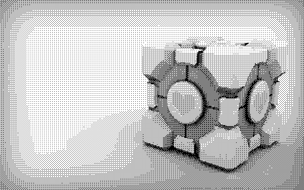

# Алгоритм рассеивания ошибок Флойда-Стейнберга

```python
fs_dithering('img.jpg')
```
Рассеивание ошибок происходит по следующей схеме:

              X   7/16
    3/16   5/16   1/16  

  

 
 # Псевдотонирование с упорядоченным размытием
 
 ```python
ordered_dithering('img.jpg', size=4)
```
Изображение разбивается на зоны, равные по размеру матрице порогов. К каждой зоне применяется данная матрица. Если текущий пиксель составляет меньше, чем 255 * <порог>, то он приравнивается 0 иначе 255.

Матрица имеет следующий вид (предварительно к каждому элементу матрицы прибавляется 1):  


В результате получается матрица порогов такого вида:  


Матрицы с измерениями, равными степеням двойки, могут быть вычислены по рекурсивной формуле:  


  


Источник:
https://habr.com/ru/post/326936/
